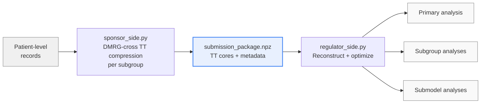

# TETRiS

**TE**nsor-**T**rain Enabled **R**egulatory Post-Marketing **S**urveillance in Self-Controlled Designs.

A reference implementation of TETRiS, a single-submission framework for high-fidelity regulatory safety evaluation under self-controlled designs (SCCS and SCRI) when patient-level data cannot be shared. The external data entity transmits a compact tensor-train representation of the conditional likelihood in place of patient-level records; the regulator reconstructs the likelihood functional locally and evaluates the primary analysis, prespecified subgroup analyses, and any nested submodel without returning to the data holder.

This repository accompanies the manuscript *TETRiS: Tensor-Train Enabled Regulatory Post-Marketing Surveillance in Self-Controlled Designs*. A synthetic dataset and the end-to-end pipeline used to produce the results in the paper are included.

## Pipeline overview



The sponsor-side pipeline (Algorithm 1A in the manuscript) is executed once by the data holder. Its output is the entire submission to the regulator. The regulator-side pipeline (Algorithm 1B) is executed locally on the submission file; no further communication with the data holder is required for any prespecified analysis.

## Repository layout

```
TETRiS/
├── config.py              Data-specific and analysis-specific knobs
├── tetris_core.py         Shared math: likelihood, Chebyshev grid,
│                          DMRG-cross, reconstruction, Wald inference
├── sponsor_side.py        Algorithm 1A: build TT submission from records
├── regulator_side.py      Algorithm 1B: reconstruct + run all analyses
├── data_generation.py     Generate synthetic SCCS dataset
├── data/                  Synthetic data and submission output
├── requirements.txt
└── LICENSE
```

`tetris_core.py`, `sponsor_side.py`, and `regulator_side.py` are dataset-agnostic. Switching to a different dataset or study requires changes only to `config.py`.

## Installation

Python 3.9 or newer is required.

```bash
git clone https://github.com/<user>/TETRiS.git
cd TETRiS
python -m venv .venv && source .venv/bin/activate
pip install -r requirements.txt
```

## Quickstart

The repository ships with a synthetic cohort of stroke events following COVID-19 vaccination, modeled on the publicly reported design of Lu et al. (FDA, 2024). Running the three scripts below reproduces the full end-to-end pipeline:

```bash
python data_generation.py      # Writes data/daily_observations.csv (1,000 patients)
python sponsor_side.py         # Writes data/submission_package.npz (TT cores per subgroup)
python regulator_side.py       # Prints primary, subgroup, and submodel results
```

`sponsor_side.py` is the only computationally intensive step, as it invokes DMRG-cross once per prespecified subgroup. `regulator_side.py` executes in seconds once the submission is available.

## How it works

The negative conditional log-likelihood of a self-controlled design is a smooth function of the parameter vector β ∈ ℝ^d. TETRiS represents this function as a tensor-train (TT) object on a Chebyshev grid over a bounded box that contains the maximum likelihood estimate and its confidence region. The TT representation is constructed adaptively by the DMRG-cross algorithm (Savostyanov and Oseledets, 2011) and never materializes the full d-dimensional grid, with TT ranks determined by a prespecified accuracy tolerance rather than by the user. On the regulator side, the likelihood functional is reconstructed from the TT cores via a Chebyshev interpolation. All downstream quantities (point estimates, Wald confidence intervals, nested submodels obtained by fixing covariate coefficients at zero, and recombinations of prespecified subgroups through patient-weighted summation) are computed by standard optimization and finite-difference Hessian evaluation on the reconstructed functional. See the Methods section of the manuscript for definitions and theoretical guarantees.

## Applying TETRiS to a different dataset

All data-specific and analysis-specific choices are consolidated in `config.py`. To apply TETRiS to a new study, edit only this file; the rest of the code does not need to change. The relevant fields are:

- `DATA_PATH`, `PATIENT_ID_COL`, `EVENT_COL`: path and column names of the daily-interval dataset.
- `CATEGORICAL_TO_BINARY`: categorical columns (e.g., risk window, calendar quarter) to expand into binary indicators.
- `COVARIATE_COLS`: the ordered list of covariates entering the model; this also determines the parameter dimension d.
- `SUBGROUP_COL`, `SUBGROUP_VALUES`: the prespecified subgroup partition. The sponsor pipeline builds one TT submission per subgroup value.
- `SUBMODELS`: named submodels to be evaluated by the regulator, each specified as a subset of `COVARIATE_COLS` to keep (omitted covariates are fixed at zero during optimization).
- `GRID_SIZE`, `BETA_LOWER`, `BETA_UPPER`, `PRIMARY_EPS`: Chebyshev grid size, parameter-box bounds, and DMRG-cross accuracy tolerance.

## License

Released under the MIT License. See `LICENSE`.
